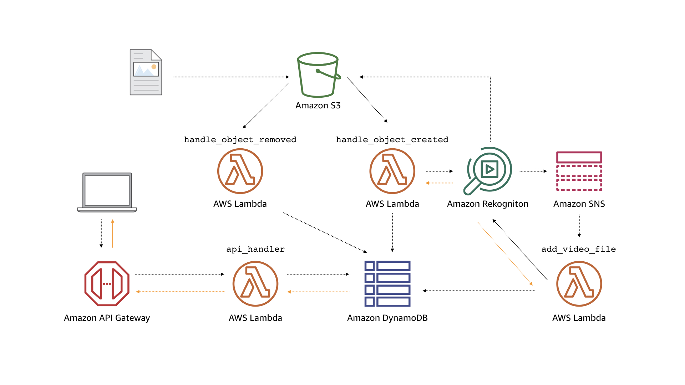

=======================
Media Query Application
=======================

This sample application shows how to combine multiple event handlers in Chalice
to create an image processing pipeline.  It takes as input any image or video
and it will identify objects, people, text, scenes, and activities.  This
results of this analysis can then be queried with a REST API.

There are several components of this application.  The first part is an image
processing pipeline.  The application is registered to automatically process
any media that's uploaded to an Amazon S3 bucket.  The application will then
use Amazon Rekognition to automatically detect labels in either the image
or the video.  The returned labels are then stored in an Amazon DynamoDB
table.

For videos, an asynchronous job is started.  This is because the analysis
for videos takes longer than analyzing images so we don't want our Lambda
function to block until the job is complete.  To handle this asynchronous
job, we subscribe to an Amazon SNS topic.  When the asynchronous job
is finished analyzing our uploaded video, an event handler is called that
will retrieve the results and store the labels in Amazon DynamoDB.

The final component is the REST API.  This allows users to query for
labels associated with the media that has been uploaded.

You can find the full source code for this application in our
`samples directory on GitHub <https://github.com/aws-samples/chalice-workshop/tree/master/code/media-query/final>`__.

.. change to once deployed: `samples directory on GitHub <https://github.com/aws/chalice/tree/master/docs/source/samples/media-query/code/>`__.

We'll now walk through the architecture of the application, how to
deploy and use the application, and go over the application code.

.. note::
    This sample application is also available as a `workshop
    <https://chalice-workshop.readthedocs.io/en/latest/media-query/index.html>`__.
    The main difference between the sample apps here and the Chalice workshops
    is that the workshop is a detailed step by step process for how to create
    this application from scratch.  You build the app by gradually adding each
    feature piece by piece.  It takes several hours to work through all the
    workshop material.  In this document we review the architecture,
    the deployment process, then walk through the main sections of the code.

Architecture
============

Below is the architecture for the application.

The main components of the application are as follows:

* ``handle_object_created``: A Lambda function that is triggered when an
  object is uploaded to a S3 bucket. If the object is an image, it will
  call Amazon Rekognition's ``DetectLabels`` API to detect objects in the
  image. With the detected objects, the Lambda function will then add the
  object to an Amazon DynamoDB table. If the object is a video, it will call
  Rekognition's ``StartLabelDetection`` API to initiate an asynchronous
  job to detect labels in the video. When the job is completed, a completion
  notification is pushed to an SNS topic.

* ``handle_object_deleted``: A Lambda function that removes the object from
  the DynamoDB table if the object is deleted from the S3 bucket.

* ``add_video_labels``: A Lambda function that is triggered on video label
  detection SNS messages. On invocation, it will call Rekognition's
  ``GetLabelDetection`` API to retrieve all detected objects from the video.
  It then adds the video with its labels to the DynamoDB Table

* ``api_handler``: A Lambda function that is invoked by HTTP requests to
  Amazon API Gateway. On invocation, it will query the database based on the
  received HTTP request and return the results to the user through API Gateway.

Deployment
==========

To deploy the application, first install the necessary requirements and
install the AWS CLI::

  $ pip install -r requirements.txt
  $ pip install awscli

Then use the AWS CLI to deploy a CloudFormation stack containing the S3 bucket,
DynamoDB table, and SNS topic needed to run this application::

  $ aws cloudformation deploy --template-file resources.json --stack-name media-query --capabilities CAPABILITY_IAM

Record the deployed resources as environment variables in the Chalice
application by running the `recordresources.py` script::

  $ python recordresources.py --stack-name media-query

Once those resources are created and recorded, deploy the Chalice application::

  $ chalice deploy

Using the Application
=====================

Once the application is deployed, use the AWS CLI to fetch the name of the
bucket that is storing the media files::

   $ aws cloudformation describe-stacks --stack-name media-query \
       --query "Stacks[0].Outputs[?OutputKey=='MediaBucketName'].OutputValue" \
       --output text
   media-query-mediabucket-xtrhd3c4b59

Upload some sample media files to your Amazon S3 bucket so the system populates
information about the media files in your DynamoDB table.  If you need sample
media files, you can use the included samples from the corresponding
`Chalice workshop <https://chalice-workshop.readthedocs.io/en/latest/media-query/index.html>`__ assets
`here <https://github.com/aws-samples/chalice-workshop/tree/master/code/media-query/final/assets>`__.

::

   $ aws s3 cp assets/sample.jpg s3://media-query-mediabucket-xtrhd3c4b59/sample.jpg
   $ aws s3 cp assets/sample.mp4 s3://media-query-mediabucket-xtrhd3c4b59/sample.mp4

Wait about a minute for the media files to be populated in the database and
then install HTTPie::

    $ pip install httpie

Then, list out all if the media files using the application's API with HTTPie::

    $ chalice url
    https://qi5hf4djdg.execute-api.us-west-2.amazonaws.com/api/

    $ http https://qi5hf4djdg.execute-api.us-west-2.amazonaws.com/api/
    HTTP/1.1 200 OK
    Connection: keep-alive
    Content-Length: 279
    Content-Type: application/json
    Date: Tue, 10 Jul 2018 17:58:40 GMT
    Via: 1.1 fa751ee53e2bf18781ae98b293ff9375.cloudfront.net (CloudFront)
    X-Amz-Cf-Id: sNnrzvbdvgj1ZraySJvfSUbHthC_fok8l5GJ7glV4QcED_M1c8tlvg==
    X-Amzn-Trace-Id: Root=1-5b44f3d0-4546157e8f5e35a008d06d88;Sampled=0
    X-Cache: Miss from cloudfront
    x-amz-apigw-id: J0sIlHs3vHcFj9g=
    x-amzn-RequestId: e0aaf4e1-846a-11e8-b756-99d52d342d60

    [
        {
            "labels": [
                "Animal",
                "Canine",
                "Dog",
                "German Shepherd",
                "Mammal",
                "Pet",
                "Collie"
            ],
            "name": "sample.jpg",
            "type": "image"
        },
        {
            "labels": [
                "Human",
                "Clothing",
                "Dog",
                "Nest",
                "Person",
                "Footwear",
                "Bird Nest",
                "People",
                "Animal",
                "Husky"
            ],
            "name": "sample.mp4",
            "type": "video"
        }
    ]

You can include query string parameters as well to query all objects based
on what the file name starts with, the type of the media file, and the detected
objects in the media file::

    $ http https://qi5hf4djdg.execute-api.us-west-2.amazonaws.com/api/ startswith==sample.m
    HTTP/1.1 200 OK
    Connection: keep-alive
    Content-Length: 153
    Content-Type: application/json
    Date: Tue, 10 Jul 2018 19:20:02 GMT
    Via: 1.1 aa42484f82c16d99015c599631def20c.cloudfront.net (CloudFront)
    X-Amz-Cf-Id: euqlOlWN5k5V_zKCJy4SL988Vcje6W5jDR88GrWr5uYGH-_ZvN4arg==
    X-Amzn-Trace-Id: Root=1-5b4506e0-db041a3492ee56e8f3d9457c;Sampled=0
    X-Cache: Miss from cloudfront
    x-amz-apigw-id: J04DHE92PHcF--Q=
    x-amzn-RequestId: 3d82319d-8476-11e8-86d9-a1e4585e5c26

    [
        {
            "labels": [
                "Human",
                "Clothing",
                "Dog",
                "Nest",
                "Person",
                "Footwear",
                "Bird Nest",
                "People",
                "Animal",
                "Husky"
            ],
            "name": "sample.mp4",
            "type": "video"
        }
    ]

    $ http https://qi5hf4djdg.execute-api.us-west-2.amazonaws.com/api/ media-type==image
    HTTP/1.1 200 OK
    Connection: keep-alive
    Content-Length: 126
    Content-Type: application/json
    Date: Tue, 10 Jul 2018 19:20:53 GMT
    Via: 1.1 88eb066576c1b47cd896ab0019b9f25f.cloudfront.net (CloudFront)
    X-Amz-Cf-Id: rwuOwzLKDM4KgcSBXFihWeNNsYSpZDYVpc8IXdT0xOu8qz8aA2Pj3w==
    X-Amzn-Trace-Id: Root=1-5b450715-de71cf04ca2900b839ff1194;Sampled=0
    X-Cache: Miss from cloudfront
    x-amz-apigw-id: J04LaE6YPHcF3VA=
    x-amzn-RequestId: 5d29d59a-8476-11e8-a347-ebb5d5f47789

    [
        {
            "labels": [
                "Animal",
                "Canine",
                "Dog",
                "German Shepherd",
                "Mammal",
                "Pet",
                "Collie"
            ],
            "name": "sample.jpg",
            "type": "image"
        }
    ]

    $ http https://qi5hf4djdg.execute-api.us-west-2.amazonaws.com/api/ label==Person
    HTTP/1.1 200 OK
    Connection: keep-alive
    Content-Length: 153
    Content-Type: application/json
    Date: Tue, 10 Jul 2018 19:20:02 GMT
    Via: 1.1 aa42484f82c16d99015c599631def20c.cloudfront.net (CloudFront)
    X-Amz-Cf-Id: euqlOlWN5k5V_zKCJy4SL988Vcje6W5jDR88GrWr5uYGH-_ZvN4arg==
    X-Amzn-Trace-Id: Root=1-5b4506e0-db041a3492ee56e8f3d9457c;Sampled=0
    X-Cache: Miss from cloudfront
    x-amz-apigw-id: J04DHE92PHcF--Q=
    x-amzn-RequestId: 3d82319d-8476-11e8-86d9-a1e4585e5c26

    [
        {
            "labels": [
                "Human",
                "Clothing",
                "Dog",
                "Nest",
                "Person",
                "Footwear",
                "Bird Nest",
                "People",
                "Animal",
                "Husky"
            ],
            "name": "sample.mp4",
            "type": "video"
        }
    ]

You can also query for a specific object::

    $ http https://qi5hf4djdg.execute-api.us-west-2.amazonaws.com/api/sample.jpg
    HTTP/1.1 200 OK
    Connection: keep-alive
    Content-Length: 126
    Content-Type: application/json
    Date: Tue, 10 Jul 2018 19:20:53 GMT
    Via: 1.1 88eb066576c1b47cd896ab0019b9f25f.cloudfront.net (CloudFront)
    X-Amz-Cf-Id: rwuOwzLKDM4KgcSBXFihWeNNsYSpZDYVpc8IXdT0xOu8qz8aA2Pj3w==
    X-Amzn-Trace-Id: Root=1-5b450715-de71cf04ca2900b839ff1194;Sampled=0
    X-Cache: Miss from cloudfront
    x-amz-apigw-id: J04LaE6YPHcF3VA=
    x-amzn-RequestId: 5d29d59a-8476-11e8-a347-ebb5d5f47789

    [
        {
            "labels": [
                "Animal",
                "Canine",
                "Dog",
                "German Shepherd",
                "Mammal",
                "Pet",
                "Collie"
            ],
            "name": "sample.jpg",
            "type": "image"
        }
    ]

Code Walkthrough
================

We'll take a top-down approach with this application and start with the main
entry point, the ``app.py`` file.  The source code for this application is
split between the ``app.py`` as well as supporting code in ``chalicelib/``.

Event Handlers
--------------

In the ``app.py`` we see four different decorator types, each corresponding
to Lambda functions that are triggered by different events.  Note that
the line numbers correspond to the line numbers in the ``app.py`` file.

.. literalinclude:: code/app.py
   :lineno-match:
   :start-after: # Start of Event Handlers
   :end-before: # End of Event Handlers

The first two decorators use ``@app.on_s3_event`` and are specifying
that these two Lambda functions should be invoked when an object is
created or deleted from S3, respectively.  The name of the S3 bucket
is not hardcoded in the ``app.py`` file but instead pulled from the
environment variable ``MEDIA_BUCKET_NAME``.  The ``recordresources.py``
script that was run as part of the deployment process described above
automatically created these resources and updated the Chalice config file
(``.chalice/config.json``) with these values.  If you look at the
contents of your ``.chalice/config.json`` file, it should look something
like this:

.. code-block:: json

    {
      "version": "2.0",
      "app_name": "media-query",
      "stages": {
        "dev": {
          "api_gateway_stage": "api",
          "autogen_policy": false,
          "environment_variables": {
            "MEDIA_TABLE_NAME": "media-query-MediaTable-10QEPR0O8DOT4",
            "MEDIA_BUCKET_NAME": "media-query-mediabucket-fb8oddjbslv1",
            "VIDEO_TOPIC_NAME": "media-query-VideoTopic-KU38EEHIIUV1",
            "VIDEO_ROLE_ARN": "arn:aws:iam::123456789123:role/media-query-VideoRole-1GKK0CA30VCAD",
            "VIDEO_TOPIC_ARN": "arn:aws:sns:us-west-2:123456789123:media-query-VideoTopic-KU38EEHIIUV1"
          }
        }
      }
    }

Next, the ``@app.on_sns_message`` is used to connect an SNS topic to our
Lambda function.  This is only used for video processing with Rekognition.
Because of the longer processing times of video compared to images,
video analysis is performed by first starting a "video label job".  When
you start this asynchronous job, we can specify an SNS topic that
Rekognition will publish to when the job is complete, as shown in the
``_handle_created_video`` function below.

.. literalinclude:: code/app.py
  :linenos:
  :lineno-match:
  :pyobject: _handle_created_video

The ``add_video_file()`` function will then query for the results
of the job (the ``JobId`` is provided as part of the SNS message
that's published) and store the results in the DynamoDB table.

The final two decorators of this app creates a REST API with
Amazon API Gateway and defines two routes: ``/`` and ``/{name}``.

Requesting the root URL of ``/`` is equivalent to a "List" API call that will
return all the media files that have been analyzed so far.  Request
``/{name}``, where ``{name}`` is the name of the media file that was uploaded
to S3 will return the detected labels for that single resource.  This is
equivalend to a "Get" API call.

.. note::
  This sample application returns all analyzed media files in its
  List API call.  In practice, you should paginate your List API calls
  to ensure you don't return unbounded results.

Supporting Files
----------------

The event handlers described in the previous section interact with
Rekognition and DynamoDB through clients that are accessed through
``get_rekognition_client()`` and ``get_rekognition_client()``
respectively.  These clients are high level wrappers to the corresponding
boto3 clients/resources for these services.  The code for these
high level clients are in ``chalicelib/rekognition.py`` and
``chalicelib/db.py``.  If we look at the ``DynamoMediaDB.add_media_file()``
method in the ``chalicelib/db.py`` file, we see that it's a small wrapper
around the ``put_item()`` operation of the underlying DynamoDB API:

.. literalinclude:: code/chalicelib/db.py
  :linenos:
  :lineno-match:
  :pyobject: DynamoMediaDB.add_media_file

We see a similar pattern in ``chalicelib/rekognition.py``.  Here's the
``start_video_label_job`` job that starts the asynchronous processing
discussed in the previous section.

.. literalinclude:: code/chalicelib/rekognition.py
  :linenos:
  :lineno-match:
  :pyobject: RekognitonClient.start_video_label_job

As you can see, it's a small wrapper around the ``start_label_detection``
operation of the underlying Rekognition API.

We encourage you to look through the rest of the ``chalicelib/`` directory
to see how these high level clients are implemented.

Cleaning Up
===========

If you're done experimenting with this sample app, you can run these commands
to delete this app.

1. Delete the chalice application::

    $ chalice delete
    Deleting Rest API: kyfn3gqcf0
    Deleting function: arn:aws:lambda:us-west-2:123456789123:function:media-query-dev
    Deleting IAM role: media-query-dev-api_handler
    Deleting function: arn:aws:lambda:us-west-2:123456789123:function:media-query-dev-add_video_file
    Deleting IAM role: media-query-dev-add_video_file
    Deleting function: arn:aws:lambda:us-west-2:123456789123:function:media-query-dev-handle_object_removed
    Deleting IAM role: media-query-dev-handle_object_removed
    Deleting function: arn:aws:lambda:us-west-2:123456789123:function:media-query-dev-handle_object_created
    Deleting IAM role: media-query-dev-handle_object_created

2. Delete all objects in your S3 bucket::

    $ aws s3 rm s3://$MEDIA_BUCKET_NAME --recursive
    delete: s3://media-query-mediabucket-4b1h8anboxpa/sample.jpg
    delete: s3://media-query-mediabucket-4b1h8anboxpa/sample.mp4

3. Delete the CloudFormation stack containing the additional AWS resources::

    $ aws cloudformation delete-stack --stack-name media-query
