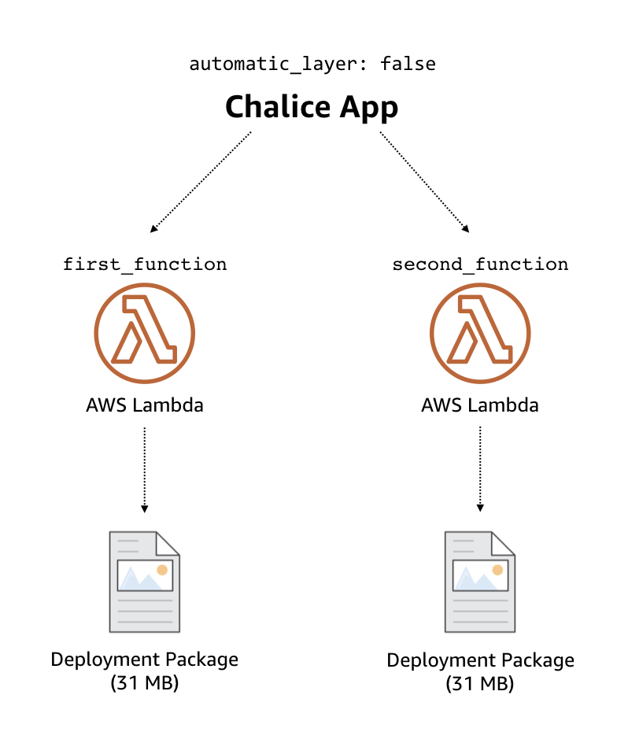
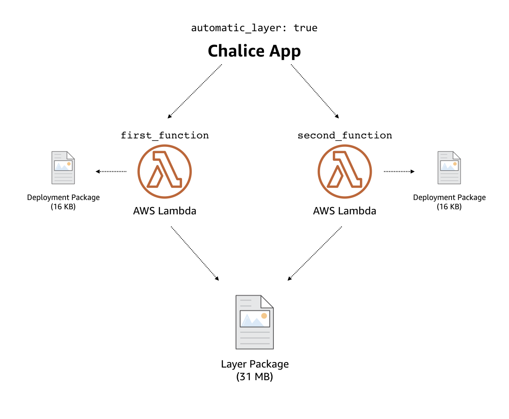

App Packaging
=============

In order to deploy your Chalice app, a zip file is created that
contains your application and all third party packages your application
requires.  This file is used by AWS Lambda and is referred
to as a deployment package.

Chalice will automatically create this deployment package for you, and offers
several features to make this easier to manage.  Chalice allows you to
clearly separate application specific modules and packages you are writing
from 3rd party package dependencies.

By default, Chalice will create a single zip file containing everything
necessary to deploy your application to Lambda.  Chalice also has
the ability to split your code into multiple files to leverage
`AWS Lambda layers <https://docs.aws.amazon.com/lambda/latest/dg/configuration-layers.html>`__.
This is discussed in the :ref:`package-3rd-party` section below.

App Directories
---------------

You have two options to structure application specific code/config:

* **app.py** - This file includes all your route information and is always
  included in the deployment package.
* **chalicelib/** - This directory (if it exists) is included in the
  deployment package.  This is where you can add config files and additional
  application modules if you prefer not to have all your app code in the
  ``app.py`` file.

See :doc:`multifile` for more info on the ``chalicelib/`` directory.  Both the
``app.py`` and the ``chalicelib/`` directory are intended for code that you
write yourself.

.. _package-3rd-party:

3rd Party Packages
------------------

When handling third party packages, you can have Chalice manage
these files as part of the deployment package of your Lambda function,
or as a separate Lambda layer that's shared by all your Lambda functions.
See the :ref:`package-examples` section for examples of how this works.

There are two options for handling python package dependencies:

* **requirements.txt** - During the packaging process, Chalice will
  install any packages it finds or can build compatible wheels for.
  Specifically all pure python packages as well as all packages that upload
  wheel files for the ``manylinux1_x86_64`` platform will be automatically
  installable.
* **vendor/** - The *contents* of this directory are automatically added to
  your deployment package and its location in your Lambda functions will
  depend on whether you are using automatic Lambda Layers, described in the
  :ref:`package-auto-layers` section.

Chalice will also check for an optional ``vendor/`` directory in the project
root directory.  The contents of this directory are automatically included in
the top level of the deployment package (see :ref:`package-examples` for
specific examples).  The ``vendor/`` directory is helpful in these scenarios:

* You need to include custom packages or binary content that is not accessible
  via ``pip``.  These may be internal packages that aren't public.
* Wheel files are not available for a package you need from pip.
* A package is installable with ``requirements.txt`` but has optional c
  extensions. Chalice can build the dependency without the c extensions, but
  if you want better performance you can vendor a version that is compiled.

As a general rule of thumb, code that you write goes in either ``app.py`` or
``chalicelib/``, and dependencies are either specified in ``requirements.txt``
or placed in the ``vendor/`` directory.

.. _package-auto-layers:

Automatic Lambda Layers
~~~~~~~~~~~~~~~~~~~~~~~

By default, Chalice will create a single zip file that contains all the
code needed to run your application.

You can set the :ref:`automatic-layer-option` in your ``.chalice/config.json``
file which will instruct Chalice to create your 3rd party packages as a
separate Lambda layer.

There are several benefits to this approach:

* The layer is created once and then shared across all Lambda functions in
  your application.
* When creating or updating a Lambda function, you send the entire contents
  of the zip file that contains your app.  This is repeated for each Lambda
  function.  As a result, there is unnecessary time and network bandwidth
  used to send the same 3rd party dependencies for each Lambda function.
  When using layers, Chalice will specify the layer ARN when creating or
  updating your Lambda function, which cuts down on the time it takes
  to package and deploy your application.
* Saves storage space in Lambda.  There is a 75GB maximum size for all
  your Lambda functions.  If you're not using layers, each Lambda function
  stores its own copies of your 3rd party dependencies.

We recommend setting ``"automatic_layer": true`` in your
``.chalice/config.json`` due to these benefits.

Migrating to ``"automatic_layer": true`` is mostly backwards compatible
with one notable exception: the location of the vendor files is different.

When not using automatic layers, any files placed in ``vendor/`` will be
available in your CWD of your application.  However, when using layers,
these files will be unzipped to ``/opt/python/lib/pythonX.Y/site-packages``.
If you are using the ``vendor/`` directory to include custom built python
packages then this change is transparent as that directory is automatically
added to the python path.  However, if you are trying to read a file from
``vendor/`` directly, then this will no longer work.  For example, if you
have::

    .
    ├── app.py
    └── vendor
        └── myimage.png

And your ``app.py`` attempts to read this file:

.. code-block:: python

   @app.lambda_function()
   def handler(event, context):
       with open('myimage.png') as f:
           do_something(f)

This code will no longer work.  You have two options.  You can either place
static assets in ``chalicelib/`` or you'll have to check both directories for
your file::

'/opt/python/lib/python%s.%s/site-packages' % sys.version_info[:2]

.. code-block:: python

   @app.lambda_function()
   def handler(event, context):
       with open_vendor_file('myimage.png') as f:
           do_something(f)

   def open_vendor_file(filename):
       directories = [
           '.',
           '/opt/python/lib/python%s.%s/site-packages' % sys.version_info[:2]
       ]
       for dirname in directories:
           full_path = os.path.join(dirname, filename)
           if os.path.isfile(full_path):
               return open(full_path)

Environment Variables
---------------------

As part of the packaging and deployment process, Chalice will import your
``app.py`` file.  This will result in any top level module code being
executed.  This can sometimes have undesireable behavior.
When running any Chalice CLI commands, a ``AWS_CHALICE_CLI_MODE`` environment
variable is set.  You can check if this env var is set in your ``app.py``
if you have code that you don't want to run whenever your app is packaged
and deployed.

.. code-block:: python

   import os

   app = Chalice(app_name='testimport')

   expensive_connection = None
   if 'AWS_CHALICE_CLI_MODE' not in os.environ:
       # We're running in Lambda, we want to start up
       # our connection to our DB.
       expensive_connection = ConnectToDB()

Chalice will also set any environment variables specified in your global or
stage specific configuration whenever your app is packaged and deployed.
Per-Lambda function environment variables are not set when importing your app
(this would require importing your application for each Lambda function).  For
example, given the config below you would be able to access the ``STAGE_VAR``
environment variable but not the ``PER_FUNCTION`` variable during the
building/packaging process when Chalice imports your application.  This
can be useful if you want to move configuration or resource names out of
your app.py file.

::

  {
    "stages": {
      "dev": {
        "environment_variables": {
          "STAGE_VAR": "stage-var"
        }
        "api_gateway_stage": "api",
        "lambda_functions": {
          "foo": {
            "environment_variables": {"PER_FUNCTION": "per-function"}
          }
        }
      }
    },
    "version": "2.0",
    "app_name": "demo"
  }

This only applies to the packaging stage.  When the ``foo`` function is invoked
on Lambda, the ``PER_FUNCTION`` environment variable will be set as expected.

.. _package-examples:

Examples
--------

Suppose I have the following app structure::

    .
    ├── app.py
    ├── chalicelib
    │   ├── __init__.py
    │   └── utils.py
    ├── requirements.txt
    └── vendor
        ├── myimage.png
        └── internalpackage
            └── __init__.py

And the ``requirements.txt`` file had one requirement::

    $ cat requirements.txt
    sortedcontainers==1.5.4

With the default behavior of not using layers (``"automatic_layer": false``),
the final deployment package directory structure would look like this::

    deployment.zip
    .
    ├── app.py
    ├── chalicelib
    │   ├── __init__.py
    │   └── utils.py
    ├── myimage.png
    ├── internalpackage
    │   └── __init__.py
    └── sortedcontainers
        └── __init__.py

This directory structure is then zipped up and sent to AWS Lambda during the
deployment process.  Suppose our application had two Lambda functions.
Each Lambda function has its own copy of the application deployment package,
as shown in the architecture diagram below.

If you are using ``"automatic_layer": true``, then two zip files will be
created. The deployment package used for the Lambda function will be::

    deployment.zip
    .
    ├── app.py
    └── chalicelib
        ├── __init__.py
        └── utils.py

And the zip file for the shared lambda layer will look like this::

    layer-deployment.zip
    .
    └── python
        └── lib
            └── python3.7
                └── site-packages
                    ├── myimage.png
                    ├── internalpackage
                    │   └── __init__.py
                    └── sortedcontainers
                        └── __init__.py

Below is an updated diagram of the same Chalice application using automatic
layers.  Both functions now share the same Lambda layer that contains the third
party packages used by the application.

Cryptography Example
--------------------

.. note::
   Since the original version of this example was written, cryptography has
   released version 2.0 which does have manylinux1 wheels available. This
   means if you want to use cryptography in a Chalice app all you need to
   do is add ``cryptography`` or ``cryptography>=2.0`` in your
   requirements.txt file.

   This example will use version 1.9 of Cryptography
   because it is a good example of a library with C extensions and no wheel
   files.

Below shows an example of how to use the
`cryptography 1.9 <https://pypi.org/project/cryptography/1.9/>`__ package
in a Chalice app for the ``python3.6`` lambda environment.

Suppose you are on a Mac or Windows and want to deploy a Chalice app that
depends on the ``cryptography==1.9`` package. If you simply add it to your
``requirements.txt`` file and try to deploy it with ``chalice deploy`` you will
get the following warning during deployment::

  $ cat requirements.txt
  cryptography==1.9
  $ chalice deploy
  Updating IAM policy.
  Updating lambda function...
  Creating deployment package.

  Could not install dependencies:
  cryptography==1.9
  You will have to build these yourself and vendor them in
  the chalice vendor folder.

  Your deployment will continue but may not work correctly
  if missing dependencies are not present. For more information:
  http://aws.github.io/chalice/topics/packaging.html

This happened because the ``cryptography`` version 1.9 does not have wheel
files available on PyPi, and has C extensions. Since we are not on the same
platform as AWS Lambda, the compiled C extensions Chalice built were not
compatible. To get around this we are going to leverage the ``vendor/``
directory, and build the ``cryptography`` package on a compatible linux system.

You can do this yourself by building ``cryptography`` on an Amazon Linux
instance running in EC2. All of the following commands were run inside a
``python 3.6`` virtual environment.

* Download the source first::

    $ pip download cryptography==1.9

  This will download all the requirements into the current working directory.
  The directory should have the following contents:

  * ``asn1crypto-0.22.0-py2.py3-none-any.whl``
  * ``cffi-1.10.0-cp36-cp36m-manylinux1_x86_64.whl``
  * ``cryptography-1.9.tar.gz``
  * ``idna-2.5-py2.py3-none-any.whl``
  * ``pycparser-2.17.tar.gz``
  * ``six-1.10.0-py2.py3-none-any.whl``

  This is a complete set of dependencies required for the cryptography package.
  Most of these packages have wheels that were downloaded, which means they can
  simply be put in the ``requirements.txt`` and Chalice will take care of
  downloading them. That leaves ``cryptography`` itself and ``pycparser`` as
  the only two that did not have a wheel file available for download.

* Next build the ``cryptography`` source package into a wheel file::

    $ pip wheel cryptography-1.9.tar.gz

  This will take a few seconds and build a wheel file for both ``cryptography``
  and ``pycparser``. The directory should now have two additional wheel files:

  * ``cryptography-1.9-cp36-cp36m-linux_x86_64.whl``
  * ``pycparser-2.17-py2.py3-none-any.whl``

  The ``cryptography`` wheel file has been built with a compatible
  architecture for Lambda (``linux_x86_64``) and the ``pycparser`` has been
  built for ``any`` architecture which means it can also be automatically
  packaged by Chalice if it is listed in the ``requirements.txt`` file.

* Download the ``cryptography`` wheel file from the Amazon Linux instance and
  unzip it into the ``vendor/`` directory in the root directory of your Chalice
  app.

  You should now have a project directory that looks like this::

     $ tree
     .
     ├── app.py
     ├── requirements.txt
     └── vendor
         ├── cryptography
         │   ├── ... Lots of files
         │
         └── cryptography-1.9.dist-info
             ├── DESCRIPTION.rst
             ├── METADATA
             ├── RECORD
             ├── WHEEL
             ├── entry_points.txt
             ├── metadata.json
             └── top_level.txt

  The ``requirements.txt`` file should look like this::

    $ cat requirements.txt
    cffi==1.10.0
    six==1.10.0
    asn1crypto==0.22.0
    idna==2.5
    pycparser==2.17

  In your ``app.py`` file you can now import ``cryptography``, and these
  dependencies will all get included when the ``chalice deploy`` command is
  run.
